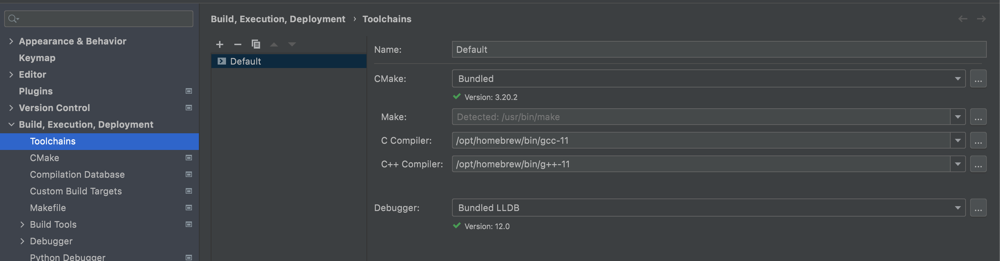

# locals

# init
- キーボード設定を修正
- Safariからchromeをダウンロードする
- https://brew.sh/index_ja から brew をインストール
- ~/.zshrcに下記を追加
```shell
typeset -U path PATH
path=(
  /opt/homebrew/bin(N-/)
  /opt/homebrew/sbin(N-/)
  /usr/bin
  /usr/sbin
  /bin
  /sbin
  /usr/local/bin(N-/)
  /usr/local/sbin(N-/)
  /Library/Apple/usr/bin
)
```
- Source treeから https://www.atlassian.com/ja/software/sourcetree をインストール
- https://github.com/ にアクセス
- source treeでssh keyを作成
- https://github.com/ningenMe/locals を ~/repos/にclone
- https://www.jetbrains.com/ でintellijをインストール
- webstorm,clion,golandも余裕があればインストール


# app
- discordをインストール
- 画面共有に許可を入れる

# runtime
- 基本的にはasdfで入れる
## asdf
- http://asdf-vm.com/guide/getting-started.html#_1-install-dependencies を読んでセットアップしていく
```shell
brew install asdf
# パスを通す
echo -e "\n. $(brew --prefix asdf)/libexec/asdf.sh" >> ${ZDOTDIR:-~}/.zshrc
# asdfが通るか確認
asdf plugin list all
# 依存関係を追加
brew install gpg gawk
```

## nodejs
```shell
asdf plugin add nodejs https://github.com/asdf-vm/asdf-nodejs.git
asdf list all nodejs
asdf install nodejs 16.13.1
asdf global nodejs 16.13.1
node --version
```

## yarn
```shell
asdf plugin add yarn https://github.com/twuni/asdf-yarn.git
asdf list all yarn
asdf install yarn 1.22.17
asdf global yarn 1.22.17
yarn --version

## ダメだったらこれも
yarn add sharp
```

## java
- https://www.azul.com/downloads/?version=java-17-lts&os=macos&architecture=arm-64-bit&package=jdk からインストール(asdfでm1で動くやつがなかった)
- 下記コマンドで確認
```
ls /Library/Java/JavaVirtualMachines 
java --version
```

## go
```shell
asdf plugin add golang https://github.com/kennyp/asdf-golang.git
asdf list all golang
asdf install golang 1.17.3
asdf global golang 1.17.3
go version
go get github.com/spf13/cobra
```

## c++ 
- asdfにないっぽいのでbrew
- clangじゃなくてgccを入れる
```shell
brew install gcc
g++-11 --version
```
- clionにg++パスを通すのは下記のsetting

- `single file execution` でplugin検索して `C/C++ Single File Execution` をインストール

## rust
```shell
asdf plugin add rust https://github.com/code-lever/asdf-rust.git
asdf list all rust
asdf install rust 1.56.1
asdf global rust 1.56.1
cargo --version
rustc --version
rustdoc --version
```

## python
```shell
python3 --version
```

## docker
- https://docs.docker.com/desktop/mac/apple-silicon/ からインストール
```shell
softwareupdate --install-rosetta
```
- パス通るの時間かかるかも？
```shell
docker --version
docker-compose --version
```
動かない時はdocker-desktopを最新にしたり、macを再起動したりする

## terraform
```shell
asdf plugin add terraform https://github.com/Banno/asdf-hashicorp.git
asdf list all terraform
asdf install terraform 1.1.4
asdf global terraform 1.1.4
terrafom --version
```

## awscli
- https://github.com/aws/aws-cli/blob/v2/CHANGELOG.rst でバージョン確認
```shell
cd ~
curl "https://awscli.amazonaws.com/AWSCLIV2.pkg" -o "AWSCLIV2.pkg"
sudo installer -pkg AWSCLIV2.pkg -target /
rm AWSCLIV2.pkg 
aws --version
```

## mysql
- asdfだとややこしかったのでbrewで入れる
```shell
brew search mysql
brew install mysql@5.7
echo 'export PATH="/opt/homebrew/opt/mysql@5.7/bin:$PATH"' >> ~/.zshrc
source ~/.zshrc
mysql --version
```

## gradle
```shell
asdf plugin add gradle https://github.com/rfrancis/asdf-gradle.git
asdf list all gradle
asdf install gradle 7.3
asdf global gradle 7.3
gradle --version
```

## tree
```shell
brew install tree
```

## zsh-completions
```shell
brew install zsh-completions
chmod -R go-w /opt/homebrew/share
```

## redis
```shell
asdf plugin add redis-cli https://github.com/NeoHsu/asdf-redis-cli.git
asdf list all redis-cli
asdf install redis-cli 6.2.6
asdf global redis-cli 6.2.6
redis-cli --version
```
